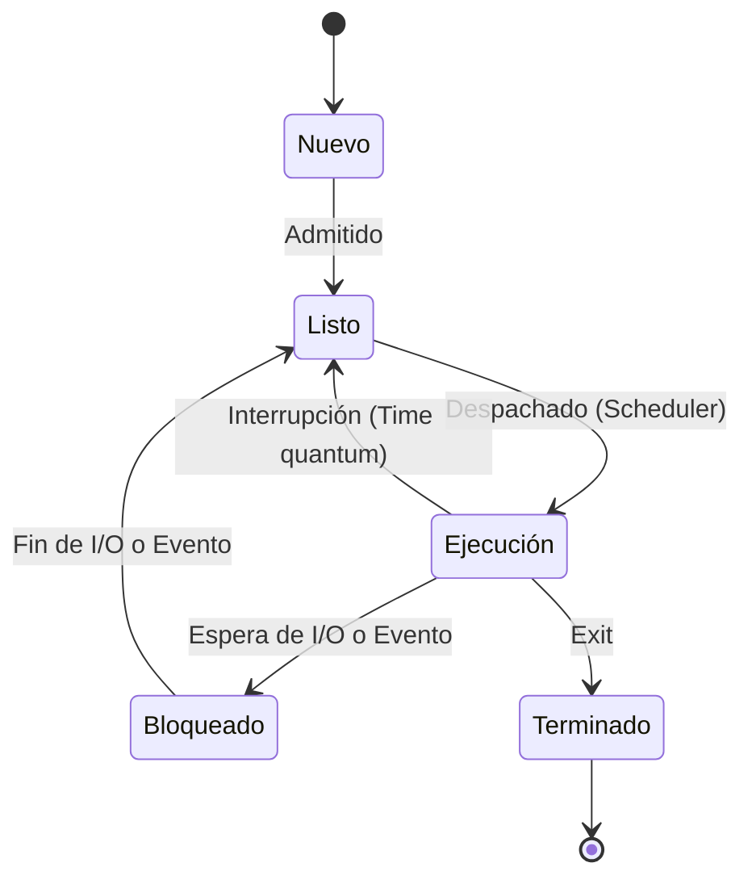

---
tags:
  - teoría
  - tema/2
  - procesos
estado: "en progreso"
---

# Tema 2: Gestión de Procesos

## Concepto de Proceso

Un proceso es, en esencia, **un programa en ejecución**. Mientras que el código fuente en disco es un ente pasivo, un proceso es una entidad activa.

> [!note] Componentes de un Proceso
> - El código del programa (Text section).
> - El Contador de Programa (PC) y registros del procesador.
> - La pila (Stack): Datos temporales, variables locales.
> - La sección de datos (Data section): Variables globales.
> - El montículo (Heap): Memoria asignada dinámicamente.

## Estados de un Proceso

Un proceso atraviesa varios estados durante su ciclo de vida. Podemos representarlo con un diagrama:

## Bloque de Control de Proceso (PCB)

Cada proceso se representa en el SO mediante un **PCB** (Process Control Block), que contiene mucha información asociada al proceso específico:
- Estado del proceso.
- Contador de programa.
- Registros de la CPU.
- Información de planificación de CPU.
- Información de gestión de memoria.
- Información contable.
- Información de estado de I/O.

## Hilos (Threads)

A diferencia de los procesos tradicionales (pesados), los hilos comparten espacio de direcciones. 
Lee más en: [[Hilo (Thread)]]

## Problemas de Concurrencia

Al ejecutar múltiples procesos, podemos encontrarnos con situaciones de:
1. Condición de carrera (Race condition).
2. [[Deadlock|Interbloqueo (Deadlock)]].
